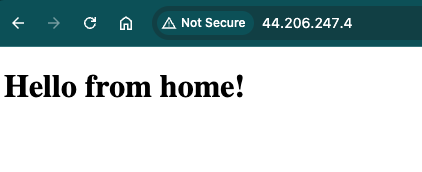
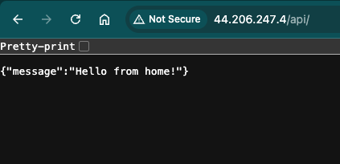
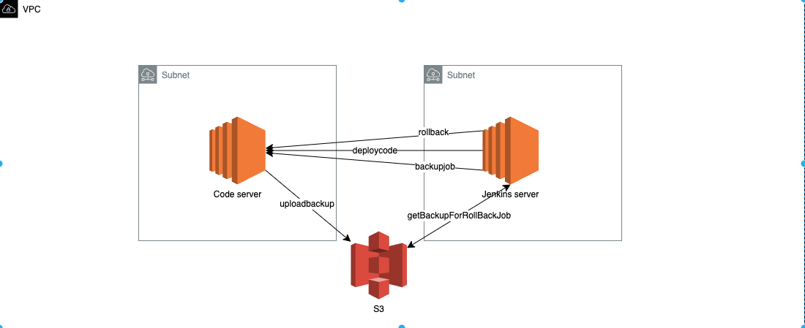

# Simple DevOps Project

This project demonstrates a full-stack application setup with Flask (Python) for the backend and Nginx for the frontend, all orchestrated with Docker, Docker Compose, Ansible, jenkins, and AWS S3 for backup.

---

## Project Structure

### Here is the directory structure of the project:

---

## Jenkins

 Jenkins used to run ansible playbooks please note that the jenkins is using ansible plugin not jenkins pipeline since this project let the    ansible do most of the work jenkins here is only for trggering playbooks.

Jenkins IP: http://44.204.183.193/

---
## Nginx 
### frontend http://server-ip/

### Backend http://server-ip/api/

---
## Infra

Deployment:  Jenkins job will be triggerd then the ansible playbook will take the source code and deploy it on the code server then run the docker compose.

Backup:      Jenkins will trigger the playbook for backup it will backup the soruce code and redis dump.rdb and send it to the s3 bucket in the    needed path

Rollback:    Jenkins will trigger the playbook for Rollback it will take the backup from the s3 and redeploy it on the server code.

