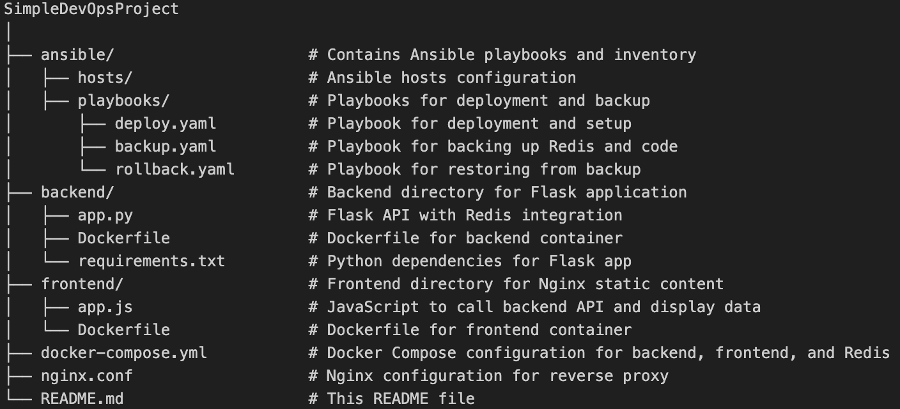

# Simple DevOps Project

This project demonstrates a full-stack application setup with Flask (Python) for the backend and Nginx for the frontend, all orchestrated with Docker, Docker Compose, Ansible, jenkins, and AWS S3 for backup.

---

## Project Structure

### Here is the directory structure of the project:

---

## Jenkins

 Jenkins used to run ansible playbooks please note that the jenkins is using ansible plugin not jenkins pipeline since this project let the    ansible do most of the work jenkins here is only for trggering playbooks.

Jenkins IP: http://44.204.183.193/

