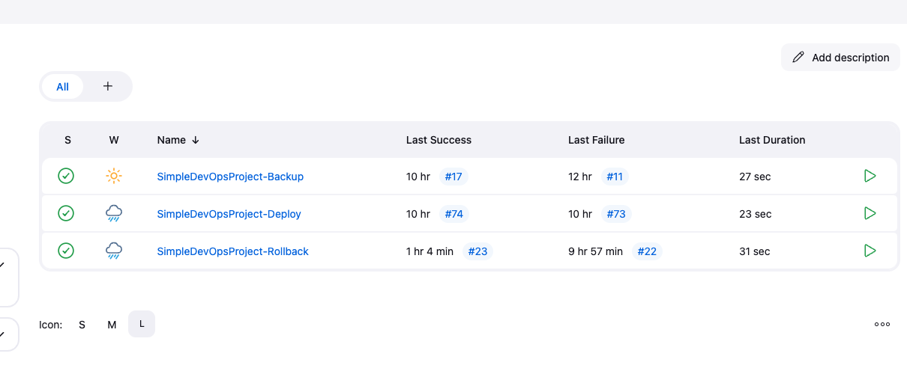

# Simple DevOps Project

This project demonstrates a full-stack application setup with Flask (Python) for the backend and Nginx for the frontend, all orchestrated with Docker, Docker Compose, Ansible, jenkins, and AWS S3 for backup.

---

## Project Structure

### Here is the directory structure of the project:

...bash
SimpleDevOpsProject
│
├── ansible/                     # Contains Ansible playbooks and inventory
│   ├── hosts/                   # Ansible hosts configuration
│   ├── playbooks/               # Playbooks for deployment and backup
│       ├── deploy.yaml          # Playbook for deployment and setup
│       ├── backup.yaml          # Playbook for backing up Redis and code
│       └── rollback.yaml        # Playbook for restoring from backup
├── backend/                     # Backend directory for Flask application
│   ├── app.py                   # Flask API with Redis integration
│   ├── Dockerfile               # Dockerfile for backend container
│   └── requirements.txt         # Python dependencies for Flask app
├── frontend/                    # Frontend directory for Nginx static content
│   ├── app.js                   # JavaScript to call backend API and display data
│   └── Dockerfile               # Dockerfile for frontend container
├── docker-compose.yml           # Docker Compose configuration for backend, frontend, and Redis
├── nginx.conf                   # Nginx configuration for reverse proxy
└── README.md                    # This README file
...

---

## Jenkins

 Jenkins used to run ansible playbooks please note that the jenkins is using ansible plugin not jenkins pipeline since this project let the    ansible do most of the work jenkins here is only for trggering playbooks.

Jenkins IP: http://44.204.183.193/

